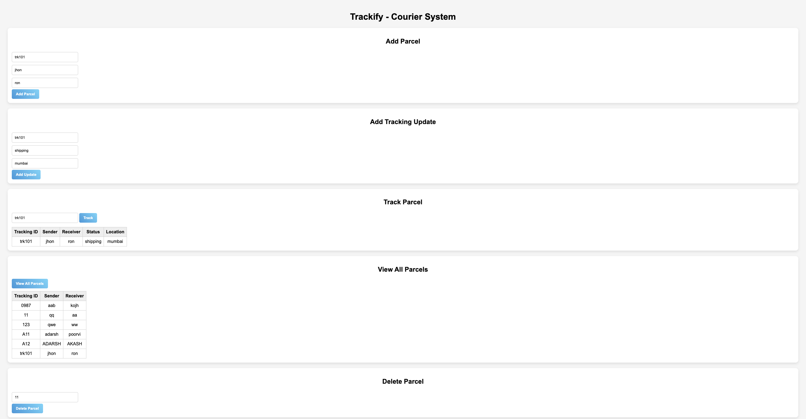

# 🚚 Trackify – Smart Courier Tracking System

## 📌 Project Overview
Trackify is a simple and efficient courier tracking system that allows users to manage and track parcels in real-time. This is a beginner-friendly full-stack project built using Node.js and MySQL.

## 🔧 Tech Stack
- Node.js
- Express.js
- MySQL
- HTML, CSS, JavaScript

## 🚀 Features
- 📦 Add parcel details (Sender, Receiver, Tracking ID)
- 🔄 Update parcel status and location
- 🔍 Track parcel using tracking ID
- 📋 View all parcels
- ❌ Delete parcel

## ▶️ How to Run the Project

1. Clone the repository:
git clone https://github.com/yourusername/trackify-courier-system.git
cd trackify-courier-system

2. Install dependencies:
npm install express mysql2 cors

3. Start MySQL server

4. Create database and tables:
CREATE DATABASE trackify_db;
USE trackify_db;

CREATE TABLE parcels (
    tracking_id VARCHAR(50) PRIMARY KEY,
    sender VARCHAR(100),
    receiver VARCHAR(100)
);

CREATE TABLE tracking_updates (
    id INT AUTO_INCREMENT PRIMARY KEY,
    tracking_id VARCHAR(50),
    status VARCHAR(50),
    location VARCHAR(100)
);

5. Run backend server:
node server.js

6. Open in browser:
http://localhost:3000

## 📸 Project Preview
screenshot.png

## 🎯 Purpose
This project was built to understand backend development, REST APIs, and database integration using Node.js and MySQL.

## 👤 Author
POORVITHA KALIGAL

## ⭐ Future Improvements
- Add user authentication
- Add delivery status timeline
- Deploy project online
